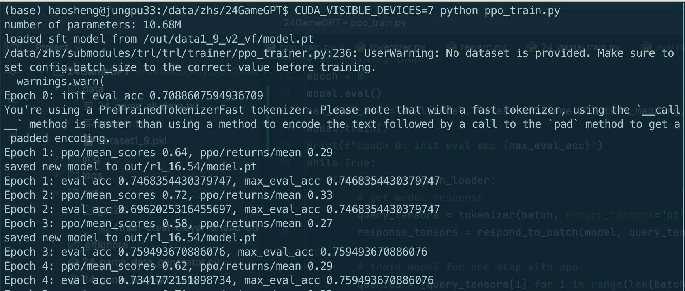
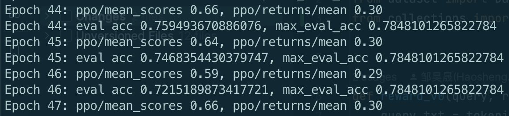
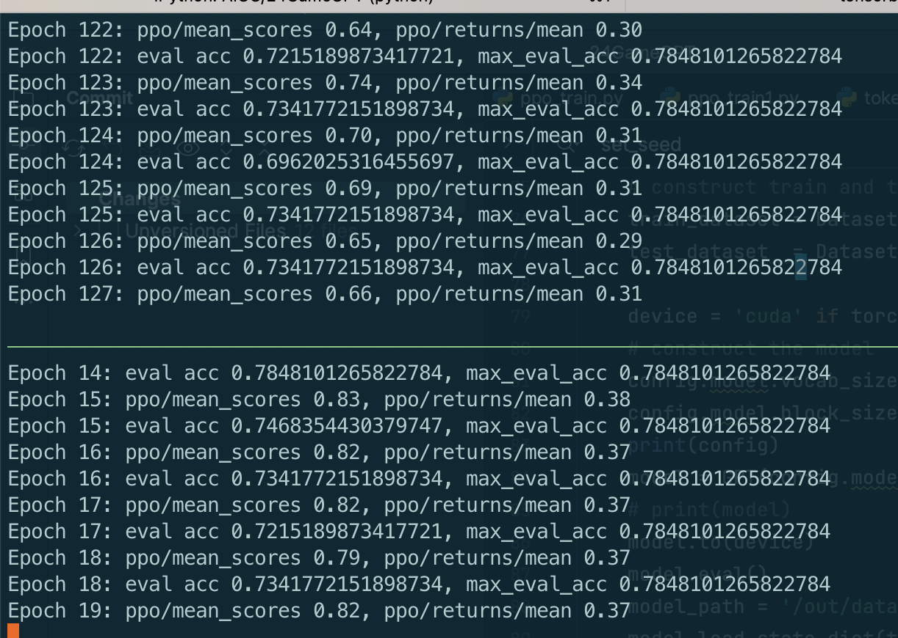

# 训练GPT算24点

## abstract
目前考虑这样格式的输入+输出：`[4, 8, 9, 3]: 8 + 4 = 12, 9 + 3 = 12, 12 + 12 = 24`

目前仅考虑了1~9的数字构成的24点问题，采用SL+RL的框架，训练一个随机初始化的10M参数GPT模型算24点。RL部分基于[trl](https://github.com/lvwerra/trl)库，将minGPT模型接入trl。

问题规模比1~13的完整24点问题小4倍，输入的4个数字考虑了所有排列，SL模型在测试集上最高有70%的正确率，接着RL fine-tune有一定的提升，正确率最高到78%。

目前的主要问题：一个是评估正确率时，对一个输入的4个数字，我遍历所有排列并sample生成，只要有一种排列能给出正确解，就算对。这样给了P4=24次sample机会应该太宽容了，并且每种排列都生成一次，不方便肉眼看结果。二是没有更多利用任务本身的特性，输出的逐步计算结果没有考虑中间步骤的顺序和数字的使用等。




## 代码
先安装小改的[trl](https://github.com/HaoshengZou/trl)
```bash
git clone https://github.com/HaoshengZou/trl.git
cd trl
pip install .
```
没有其他特殊依赖的包。若有缺失则`pip install`对应包

`python ppo_train.py` 应可复现上图的ppo训练结果

具体代码：
- `dataset.py` 数据集，读入暴力生成的所有数据，并重新划分
- `24_game_train.py` SL训练代码
- `tokenizer.py` 适配trl/huggingface接口的tokenizer
- `ppo_train.py` RL训练代码


## 方法

- SL
  - 数据
    - 简化了，只考虑了1~9构成的24点问题，这样输入都是1位数字
    - 1 ~ 9：495种输入（1 ~ 13有1820种），其中404种有解，只取有解的，随机分出80道题作为测试集，划分于`data/dataset1_9.pkl`。这80道题无论SL和RL，训练时都不可见
      - 一些测试集: `[('2 2 2 4', '(2+2+2)*4'), ('4 7 8 9', '(7+8-9)*4'), ('6 8 9 9', '(9+9)*8/6'), ('3 3 8 9', '(3+8)*3-9'), ('4 4 5 7', '(4+7-5)*4'), ('2 4 6 9', '(4-2)*9+6'), ('1 3 9 9', '(9-1)*9/3'), ('1 6 8 8', '(1+8-6)*8'), ('4 6 6 7', '(7-4)*6+6'), ('5 5 6 7', '(5*5+6)-7')]`
    - 用 `24_game_data_generator` 暴力生成了所有可行的答案。一题多解，`dataset.py`中有额外处理一题多解的对应关系 
    - 暴力生成解法、全1820道题的标注用了开源资料 [[1]](https://github.com/zhangfaen/24GameGPT) 和 [[2]](https://github.com/imkuang/game_24/blob/master/answer.txt)，但[1]测试集划分是错误的，我在`dataset.py`中重新划分了
    
  - 模型 
    - minGPT为起点，没有fine-tune 预训练好的GPT2，而是随机初始化gpt-mini后重新训练
    - tokenizer简单起见就是`"0123456789[,]:+-*/= "`单字符vocabulary

- RL
  - 起点：SL后的模型，SL的时候就做了输入全排列的data aug，所以SL初始准确率就还行 
  - 算法：常规PPO，没有特殊操作
  - 数据：和SL的训练、测试划分相同，80道题只作为测试
    - 虽然绝对题目数量不多，但考虑了输入4个数字的全排列。训练时作为data aug，测试时只要任意一种输入排列能输出正确答案，就算对
    - 输入只考虑4个1位数，整体序列长度存在最大值，全都padding空格到最大值
  - reward.py：
    - reward_v0: 正确给1，错误给-1
    - reward_v1: 错误case额外考虑是否输出了3个算式、输入数字的使用情况等，但效果没区别
     
